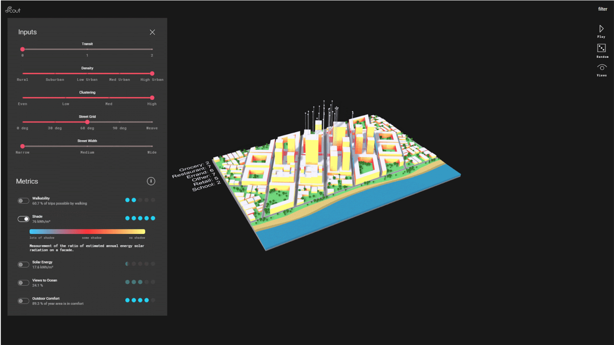

<!--  -->

## Overview Overall

Data is the language of cities. This data is inherently spatial, and as designers and planners we are uniquely suited to leverage it for informed decision making, and the improvement of buildings, public spaces, and cities. Accordingly, this course introduces students to computational design through a unique data-driven workflow for design and analysis using rhino and grasshopper. 

Students will work with and generate geo-spatial data at multiple scales: city, neighborhood and buildings. They will integrate urban data exploration, environmental performance, and derive their own data within a computational design workflow.

The techniques introduced in this course are applicable at both architectural and urban scales; at its core this class is about creating tools to measure performance, drawing with data, and visualization for decision making. The projects will focus on the urban scale: from designing new spatial metrics, to data visualization, to developing performative zoning/policy, to deploying data-driven building types across the city. Projects must be spatial, speculative, iteratively tested and quantitatively evaluated.

This course will be structured as a flipped classroom. With a few exceptions, technical content will be taught through video tutorials done outside of class. Class time will be for reviewing work, reading discussions, in class workshops and conceptual framing of the workflows and techniques. Help sessions will be provided out of class to help with the technical content as needed.

Students must know some Rhino (or do tutorials 1-3 & 6-7 of the [Drawing & Modeling in Rhino Skills Trail](https://skilltrails.gsapp.org/#/map/trail/recwGnruowadxfpVX/drawing--modeling-in-rhino/) prior to the course.) Grasshopper proficiency is not required, but a basic understanding will help. If you are new to grasshopper, it would be helpful to do [Intro to Grasshopper and Data](https://www.youtube.com/watch?v=FoUzYpMlHGw&feature=youtu.be) Trees prior to the first class.   

This year we will introduce students to [Scout](https://scout.build/), an interactive 3D web platform for visual exploration of design + data. We will export our computational design spaces from Grasshopper and load into Scout for analysis and presentations.

Grading be 30% attendance + class participation, 40% weekly assignments, and 30% for the final project.

<!--  -->

## Topics Covered

### Building Performance Evaluation Tools 
- Custom Spatial Tool Building
- Origin / Destination travel demand modeling
- Environmental simulation, physics, and validating proxies
- Performance based zoning and policy

### Analysis, Visualization and Communication   				
- Advanced techniques in rhino and grasshopper
- Statistical techniques for analyzing design spaces
- Using web based visual interfaces for design space exploration

### Creating Computational Design Models  				
- Building iterative architectural and urban scale procedural models
- Defining inputs, linking procedural models to performance tools 
- Running out design spaces

### Urban Data Exploration, Analysis and Speculation 		
- Data exploration: charts, maps, visualization 
- Working with OSM data

<!--  -->