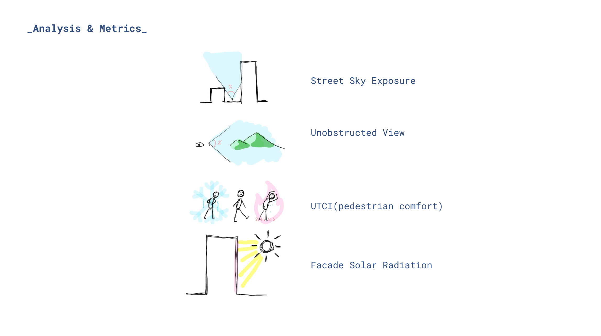
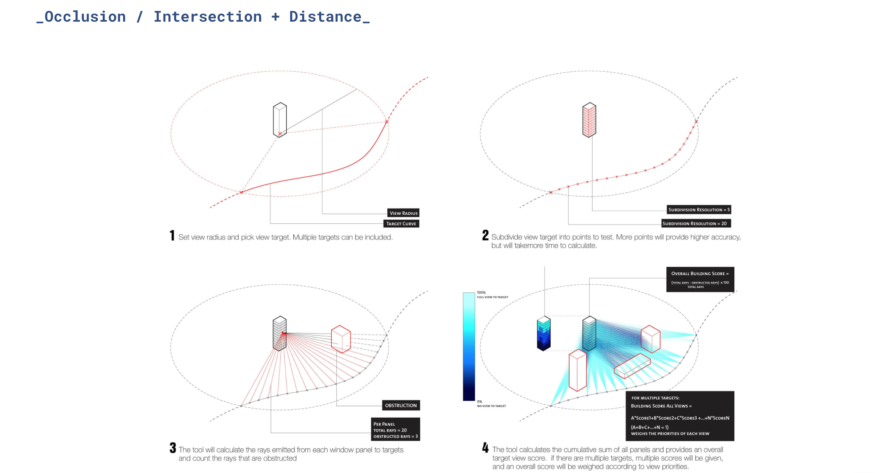
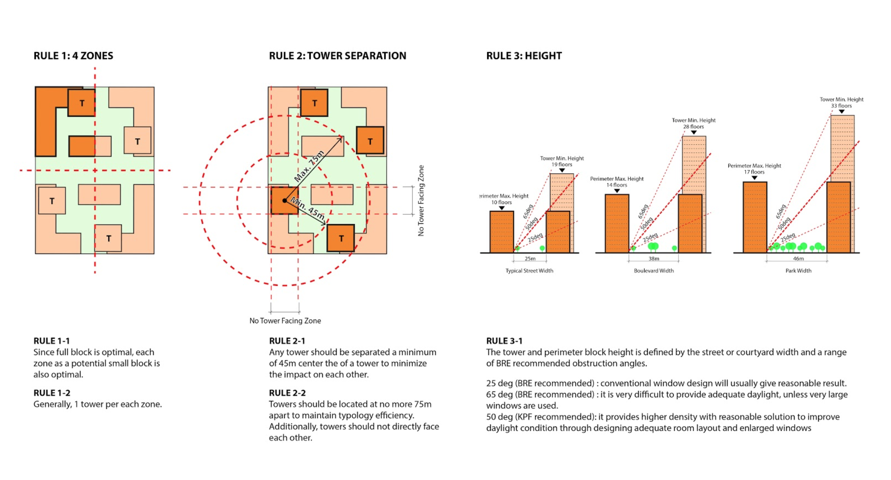

# Project Title

***Subtitle*** One sentence that summarize you project.


This image should be an ***introduction image*** that clearly describes your computational design model.
*Please include a short caption.*

<br />

***

## &nbsp;&nbsp;&nbsp;&nbsp;&nbsp;&nbsp;&nbsp;&nbsp;&nbsp;&nbsp;&nbsp;&nbsp;1. Project Overview

<br />

Clearly state both the problem that your project addresses AND an explanation of your hypothesis -- i.e., how the project might address the problem. This can incorporate the ***daring questions*** that you asked during the development of your computational model. Feel free to deviate from the Mad Libs structure, which may have now become restrictive.

For example, a daring question could be:

```
“What if all park space was equitably distributed?”
```

Then, you would take a google earth image of Manhattan and photoshop buildings in place of Central Park and many small parks scattered throughout the borough. See image below.


This image should be a ***photo collage*** that is illustrative of the outcome of your project.
*Please include a short caption describing your college.*


### Goals and Metrics

These section should be descriptive of how your team is setting up goals and metrics to determine success.

1. What are you measuring?
1. Why you are measuring it?
1. How does it relate to your goals?

i.e. how did you set up your project to measure performance and what did you expect to find?

### What Did We Discover?

At a high-level, state your conclusions. This engages the audience and helps them better follow along as you build up to how you got there. It makes them want to pay attention.


```
For example,
“Through the computational design model, we have identified X and Y trends that allows the city
to address Z while achieving or increasing A and B.”
```

Explain why the outcome of your model is important by using your:
1. Background research of your problem and proposal
1. Future context exploration and transformation of NYC into an hypothetical condition
1. Urban data mapping
Not all projets will cover all the above topics. Use what is needed to explain why the issues your project addresses matter.

<br />

***

## &nbsp;&nbsp;&nbsp;&nbsp;&nbsp;&nbsp;&nbsp;&nbsp;&nbsp;&nbsp;&nbsp;&nbsp;2. Computational Design Model

<br />


This image should be an ***computational design model diagram*** that clearly describes the relationship between your ***inputs, procedural rules and metrics***. Make a clear, easily read diagram.
*Please include a short caption.*


### Analysis Tools

*Please include a short caption describing your diagram.*


*Please include a short caption describing your diagram.*

Describe how you are deriving your metric.

1. Have a summary image with each analysis tool (examples above)
1. Use a image / diagram for each custom tool that requires further explanation on how it works. (Example below.)

#### Custom Tool Name

*Please include a short caption describing your diagram.*

[Link](https://github.com/XIM-GSAPP/XIM-GSAPP-Fa20/tree/main/src/tools) to any packaged analysis tools you have documented and posted.


### Procedural Types

This section focuses on the rules you have defined, range of variability and an explanation of how they relate to you goals and metrics. 

[Link](https://github.com/XIM-GSAPP/XIM-GSAPP-Fa20/tree/main/src/types) to any procedural types you have documented and posted.


*Please include a short caption describing your diagram.*


*Please include a short caption describing your diagram.*

It is encouraged to use sketching when illustrating rules and types of your computational design model.
*Please include a short caption describing your diagram.*


### Design Space

This section should be descriptive of your team's input ranges, the reasoning why you picked that range and explanation of what you left out. 

```
For example,
"I’m varying this input in this range because of X."
```

Please include simple diagram(s) that illustrate extremes of the design space, animated gif of design space and computational model table. The diagrams and animations should be CLEAR and SIMPLE. These can be animations showing how your model changes one variable at a time, still images explaining the variables, or other drawing types, but you must break down the complexity of your project into intelligible pieces.


*Please include a short caption describing your diagram.*

<br />

***

## &nbsp;&nbsp;&nbsp;&nbsp;&nbsp;&nbsp;&nbsp;&nbsp;&nbsp;&nbsp;&nbsp;&nbsp;3. Analysis and Results

<br />

### Exploring the Design Space

This section should be descriptive of your team's design exploration and initial insights using Scout. 

***Each team will be conducting a live demonstration of your model in Scout when presenting final project.***

Additionally, teams will be required to document their live demo on GitHub with annotated, sequential screenshots replicating the sequence of the live demonstration. Show how you can use Scout to explore scenarios or answer specific questions using the parallel coordinates chart.

```
For example,
“What if’s . . .”
```

### Results

Were certain metrics inconclusive? Were there unexpected correlations? What are the GENERAL trends in your data? What are your SPECIFIC insights/findings? You can annotate right on top of Scout screenshots or translate insights to diagrams. How does performance (metrics) relate to form (inputs)?


*Please include a short caption describing your diagram.*

### Design Comparison

Create an image comparing several options that are representative of the trends in your analysis. This should include high and low-performing options, options that perform well in some metrics but poorly in others, options that do a good job of balancing trade-offs, etc. Include text explaining the comparison image and key take-aways. Include an option that gives context to the performance as a baseline or a benchmark. For example, it could be the existing context or an option with your target density but with traditional development patterns (i.e., densification without design innovation.)

Make sure to include both images and the data. Provide a visual hierarchy so that we can see which data are most relevant, which are high vs.  low. These can be simple charts, or even just text. Focus on clearly communicating the data. 

Zoom in to talk about the best option(s) and the worst. Take a few images to detail why these options perform well or poorly. The point of this entire exercise is to create a data-driven methodology for making DECISIONS, so choose which option or options are the best and defend those choices.

### Conclusions and Next Steps

For the concluding text of your computational design model documentation, think about the following questions as you reinforce the reason why the results your team's model should implemented.

1. How do you recommend the results of your model be used? Who should learn from this?
1. If we are treating this as a proof-of-concept to illustrate the viability of this type of computational approach to the city, what are the next steps for implementation?
1. Your project evaluation relative to the anti-bias rubric we developed. These include identifying limitations, what this does and does not do or include.


### Overall format and flow of text:

For each of the sections, write the minimum amount that is necessary for your project to be understood by someone reading your post. Each section needs to stand alone but it should not be text heavy. Someone should be able to read through your post in 10 - 15 minutes.
