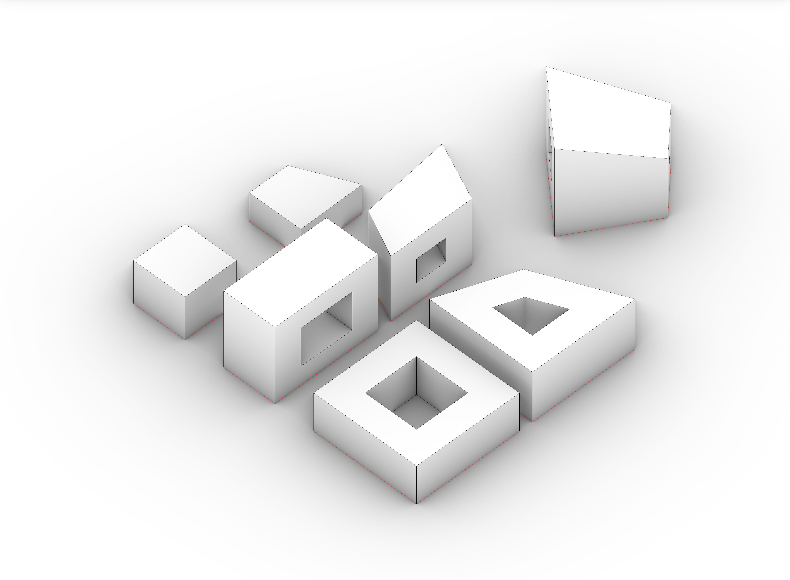
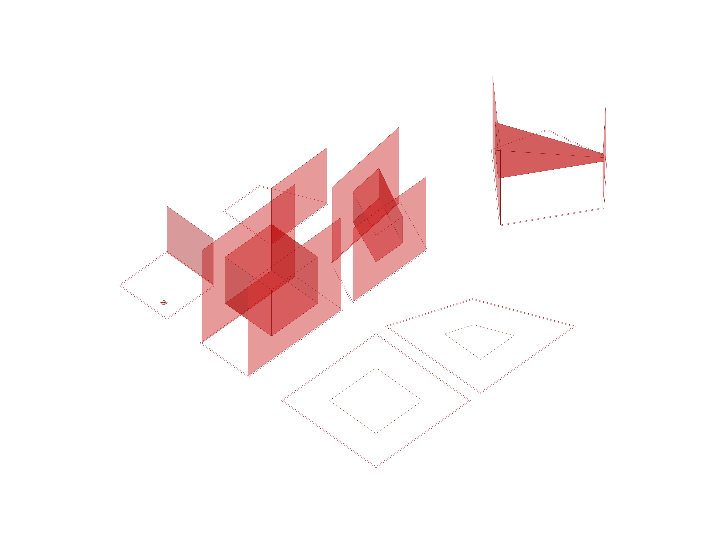

# Courtyard Type For Any Lot Size

<!--  -->

### Type Description 

This collection of structures explores the ways in which the courtyard building typology can be built and modified. This Grasshopper procedural type helps divide the lots into different groups to create a horizontal and vertical courtyard as well as solid structure, all following user inputs and pre-set procedural rules.

### Required inputs 

1. Dynamic: Lots and FAR
These are the dimensions that will determine what type of structure will be courtyards or simply solid buildings. 

1. Static: Floor to Floor Height

### Type Rules 

1. If the length of the smallest face of the courtyard is more than 85% the width of the bay of the courtyard building, then the building type should remain a typical courtyard building. 
1. If any of the face of the structure on the x-Axis can accommodate a courtyard by following the parameter set in the first rule, then the structure will have a horizontal structure. 
1. If the structure size and height cannot accommodate a vertical or horizontal (z-axis facade) courtyard, then the structure should remain as solid.

<!--  -->

### Use Type If: 

1. Your team is interested in exploring how courtyard typology could be used within your project.
1. Your team is interested in including vertical and horizontal courtyards.
1. If your team want to conduct studies of sunlight and wind, for example, based on the courtyard building typology.

### Not Recommended to Use Type If:

1. Your team is exploring more complex geometries because the end result might not meet the procedural rules and the end result might not be what you want.
1. The density target of your project is very high.
1. The height of your structures is very low.
1. Your team is exploring different building typologies other than courtyard typology.

<!--  -->

### What to Know & Limitations 

1. Courtyard offset in cluster. If you want to have each of the courtyard to offset separately then, you will have to modify the definition of the type.
1. This procedural type only supports building bay depth suitable for single loaded corridor residential or side loaded office.

### Required Plugins 

1. No specific plugins necessary

### Required Files

[Rhino File](https://github.com/XIM-GSAPP/XIM-GSAPP-Fa20/raw/main/src/types/files/Analysis%20Tool%20Example.3dm)

[Grasshopper File](https://github.com/XIM-GSAPP/XIM-GSAPP-Fa20/raw/main/src/types/files/Analysis%20Tool%20Example.gh)
